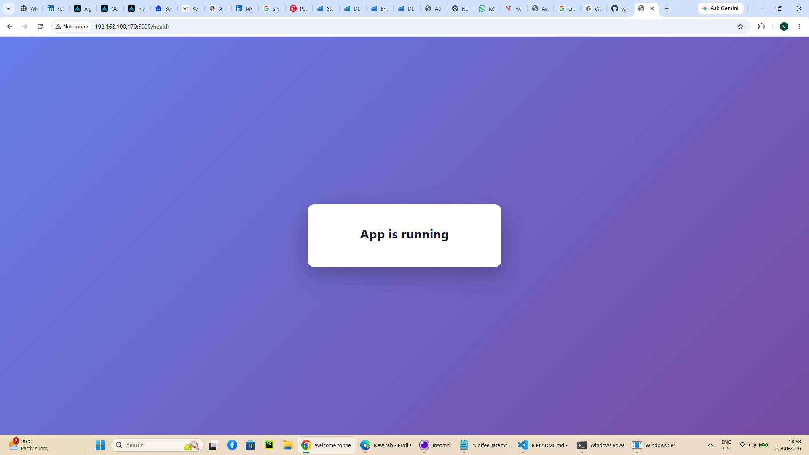
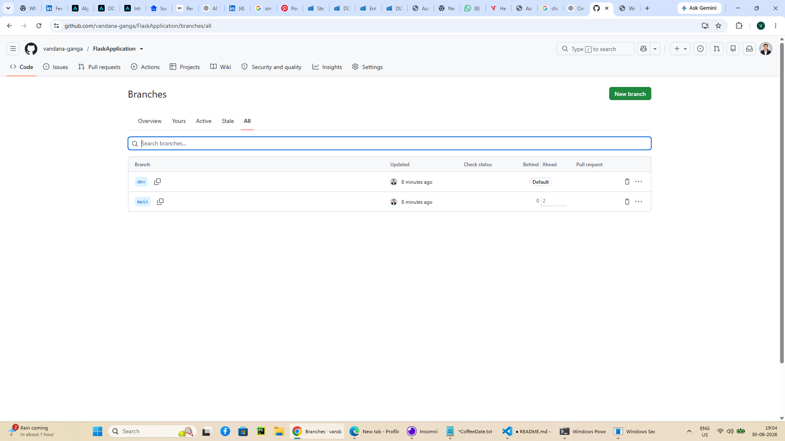
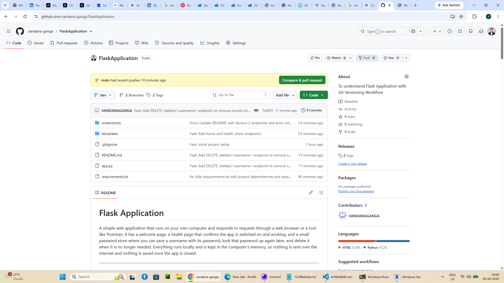

# Flask Application

A simple web application that runs on your own computer and responds to requests through a web browser
or a tool like Postman. It has a welcome page, a health page that confirms the app is switched on and
working, and a small password store where you can save a username with its password, look that
password up again later, and delete it when it is no longer needed. Everything runs locally and is kept in the computer's memory, so nothing is
sent over the internet and nothing is saved once the app is closed.

---

## Installation and Setup

Follow these steps in order. Every command is written out in full.

### 1. Download the project

```bash
git clone https://github.com/vandana-ganga/FlaskApplication.git
cd FlaskApplication
```

### 2. Create a virtual environment

A virtual environment keeps this project's packages separate from the rest of your computer.

**Windows (PowerShell):**

```powershell
py -m venv venv
```

**macOS / Linux:**

```bash
python3 -m venv venv
```

### 3. Activate the virtual environment

**Windows (PowerShell):**

```powershell
.\venv\Scripts\Activate.ps1
```

**macOS / Linux:**

```bash
source venv/bin/activate
```

Your command prompt will now start with `(venv)`.

> **If Windows blocks the activation** with the message *"running scripts is disabled on this system"*,
> run this once, then try activating again:
>
> ```powershell
> Set-ExecutionPolicy -Scope CurrentUser RemoteSigned
> ```

### 4. Install the required packages

```bash
pip install -r requirements.txt
```

### 5. Start the application

```bash
python app.py
```

You should see output ending with:

```
* Running on http://127.0.0.1:5000
```

### 6. Open it in your browser

Visit **http://localhost:5000/** and **http://localhost:5000/health**

To stop the server, press `Ctrl + C` in the terminal. To leave the virtual environment, type `deactivate`.

---

## API Endpoint Reference

| Endpoint | URL | Method | Description | Example Response |
|----------|-----|--------|-------------|------------------|
| Home | `http://localhost:5000/` | `GET` | Returns the welcome page shown to any visitor who opens the site. | `200 OK` - an HTML page displaying **Welcome to the App** |
| Health check | `http://localhost:5000/health` | `GET` | Reports whether the application is up and responding. | `200 OK` - an HTML page displaying **App is running** |
| Add credential | `http://localhost:5000/add` | `POST` | Saves a username and password sent as JSON in the request body. | `201 Created` - `{"message": "User 'vandana' added successfully", "username": "vandana"}` |
| Get password | `http://localhost:5000/get/<username>` | `GET` | Returns the stored password for that username. | `200 OK` - `{"username": "vandana", "password": "secret123"}` |
| Delete credential | `http://localhost:5000/delete/<username>` | `DELETE` | Removes that user's stored record and confirms the deletion. | `200 OK` - `{"message": "User 'vandana' deleted successfully", "username": "vandana"}` |

### Error responses

Every failure returns JSON with an explanatory message, never an HTML crash page.

| Situation | Status | Response |
|-----------|--------|----------|
| Username was never added, or already deleted | `404` | `{"error": "Username 'unknown' not found"}` |
| Body is not JSON, or missing | `400` | `{"error": "Request body must be a JSON object sent with Content-Type: application/json"}` |
| `username` or `password` missing or empty | `400` | `{"error": "Missing or empty required field(s): password"}` |
| `username` or `password` not text | `400` | `{"error": "username and password must be strings"}` |
| Wrong method used on an endpoint | `405` | `{"error": "Method not allowed. Check whether this endpoint expects GET, POST or DELETE."}` |
| URL does not exist | `404` | `{"error": "Endpoint not found"}` |

> **Note:** passwords are held in a plain Python dictionary in memory. They are not encrypted, and
> everything is erased when the server stops. This is a learning exercise, not a real password manager.

### Testing with Postman

**Saving a password** - `POST http://localhost:5000/add`

1. Set the method to `POST` and the URL to `http://localhost:5000/add`
2. Open the **Body** tab, choose **raw**, and select **JSON** from the dropdown
3. Enter:
   ```json
   {
     "username": "vandana",
     "password": "secret123"
   }
   ```
4. Press **Send** - you should get `201 Created`

**Retrieving it** - `GET http://localhost:5000/get/vandana`

1. Set the method to `GET` and the URL to `http://localhost:5000/get/vandana`
2. Press **Send** - you should get `200 OK` with the password

**Deleting a stored password** - `DELETE http://localhost:5000/delete/vandana`

1. Set the method to `DELETE` and the URL to `http://localhost:5000/delete/vandana`
2. No body is needed - the username is part of the URL
3. Press **Send** - you should get `200 OK`
4. Send `GET /get/vandana` again and it now returns `404`, proving the record is gone

**Testing a username that was never added** - `GET http://localhost:5000/get/nobody`

Returns `404 Not Found`. This test matters: it proves the app fails *gracefully* with a clear message
instead of crashing, which is how you know the error handling actually works.

### Testing from the command line

```bash
curl -X POST http://localhost:5000/add -H "Content-Type: application/json" -d "{\"username\": \"vandana\", \"password\": \"secret123\"}"

curl http://localhost:5000/get/vandana

curl http://localhost:5000/get/nobody

curl -X DELETE http://localhost:5000/delete/vandana
```

> **Why `/delete` uses the DELETE method:** the same reasoning as `/add` using POST. GET is only for
> reading and must never change stored data, so an endpoint that removes a record cannot be a GET.
> This means a plain browser address bar cannot test it - browsers only send GET. Use Postman or
> `curl -X DELETE` for this endpoint.

---

## Git Workflow

This project uses two branches to keep finished work separate from work in progress.

**`dev`** is the working branch. Every change gets built and committed here first, so mistakes never touch
the released version. **`main`** is the release branch. It only receives code from `dev` once that code has
been tested and confirmed working, which means `main` is always safe to download and run.

The cycle for each release is the same: build the feature on `dev`, commit it, push `dev` to GitHub, then
switch to `main` and merge `dev` into it. That way `main` moves forward one tested release at a time.

```
dev    ──●────────●──────────────●────────●─────────▶
         │        │              │        │
      initial   endpoints     README   version 2
      commit    added         added     features
                  │                       │
                  │ merge                 │ merge
                  ▼                       ▼
main   ───────────●───────────────────────●─────────▶
                Version 1              Version 2
```

### Commands used

```bash
git init                       # start version control in the project folder
git checkout -b dev            # create the dev branch and switch to it
git add .                      # stage the files
git commit -m "message"        # save a snapshot with a description
git push origin dev            # upload dev to GitHub

git checkout main              # switch to the release branch
git merge dev                  # bring the tested work across
git push origin main           # upload main to GitHub
```

---

## Version History

| Version | Branch merged | What it included |
|---------|---------------|------------------|
| **Version 1** | `dev` → `main` | Initial project setup with a virtual environment and `.gitignore`. Flask application (`app.py`) serving two working endpoints: `/` returning **Welcome to the App** and `/health` returning **App is running**. HTML templates for both pages. `requirements.txt` listing all dependencies. |
| **Version 2** | `dev` → `main` | In-memory password manager. `POST /add` accepts a JSON body with `username` and `password` fields and stores them in a Python dictionary. `GET /get/<username>` returns the stored password, or a `404` error if that username was never added. `DELETE /delete/<username>` removes a stored record and confirms the deletion, returning `404` if the username does not exist. Full request handling added across **all** endpoints, Version 1 included: invalid or missing JSON, empty or non-text fields, wrong HTTP methods, and unknown URLs all return a clear JSON error instead of crashing. |

---

## Screenshots

### Application running in the browser

The `/health` endpoint responding in Chrome, served by the Flask development server.



### GitHub repository showing the dev and main branches

Both branches present on GitHub, with `dev` used for development and `main` holding the released code.



### Repository overview

The repository home page showing the project files, commit count and release tags.



### Commit and merge history for Version 1 and Version 2

The branch graph showing Version 1 tagged on `main`, development continuing on `dev`, and `dev` merging
back into `main` for the Version 2 release.


---

## Project Structure

```
FlaskApplication/
├── app.py                 # the application and its two endpoints
├── requirements.txt       # list of packages needed to run it
├── screenshots/           # images used in this README
├── templates/
│   ├── index.html         # the welcome page
│   └── health.html        # the health check page
├── .gitignore             # files Git should ignore
└── README.md              # this file
```

---

## Built With

- **Python 3.11**
- **Flask 3.1.3** — the web framework that handles the endpoints


scee